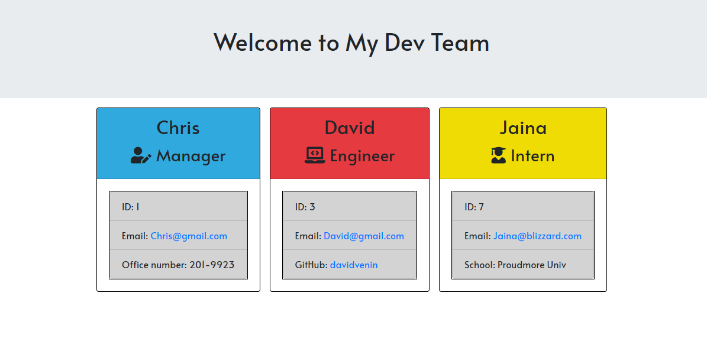

# Team Profile Generator
---
  ## Description
  This app allow users to create a HTML page with each team member cards on it.\
  User will decide if user wans to add members or not.\
  The team members have following roles : Manager, Engineer, and, Intern.\
  All of members will have infos such as, Name, Id, and E-mail.\
  Each roles have unique info such as, Office Number, Github Account, Graduated School.

---
  ## Getting Started
  - [Languages Used](#Languages&#32;Used)
  - [Installation](#Installation)
  - [Contribute](#Contribute)
  - [Test](#Test)
  - [Preivew](#Preview)
  - [Questions](#Questions)
  - [Licenses](#Licenses)

---
  ## Languages Used
  * HTML
  * CSS
  * JavaScript
    * node.js

---
  ## Installation
  
  ### Install
  To install, please type following command
  <pre> # Install dependencies
  npm install </pre>

  ### Clone
  > https://github.com/misterjaykay/team-profile-generator

---
  ## Test
  <pre> # NPM
  npm test </pre>

---
  ## Preview
  

--- 
  ## Contribute to "Team Profile Generator"

  ### How to contribute

  Please fork this repository.

---
  ## Questions

  ### Github Profile
  [Visit My Repo](https://github.com/misterjaykay)

  ### E-mail
  Please Email at misterjaykay@gmail.com

---
  ## Licenses
  MIT
  * 

